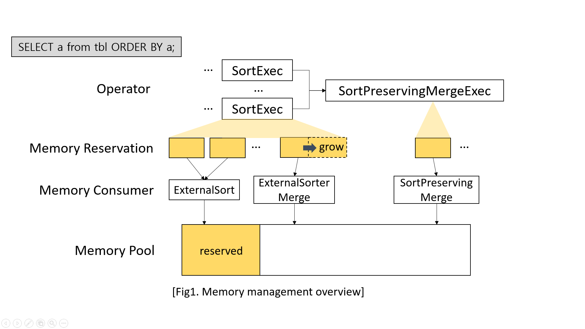
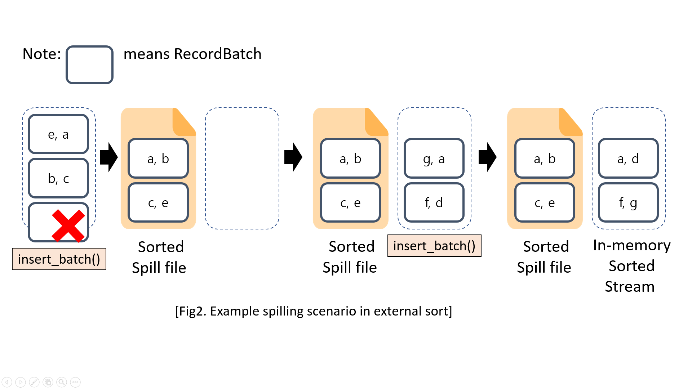
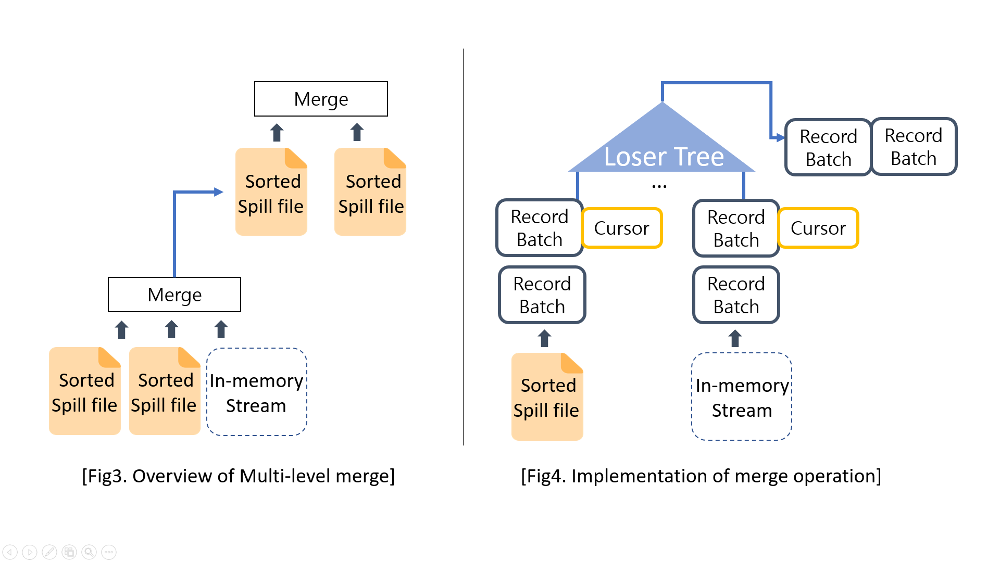

# GSoC'25 project report 
Contributor: SeoYoung Lee([@ding-young](https://github.com/ding-young))

Mentor: Yongting You([@2010YOUY01](https://github.com/2010YOUY01))

Project: [Improving Spilling Execution in DataFusion](https://summerofcode.withgoogle.com/programs/2025/projects/3Ooae7Uu)

Organization: [Apache DataFusion](https://github.com/apache/datafusion)

## Abstract
Many OLAP systems today assume that the entire working set can fit in memory. However, with SSDs becoming faster and more affordable, they are now a more economical choice compared to very large RAM. This shift makes it increasingly important to support and optimize spilling for operators — allowing memory-intensive queries to complete efficiently by temporarily writing data to disk instead of requiring massive amounts of memory.

Support for such external query execution (i.e., execution beyond available memory) already exists in DataFusion, but it remains an active area of community work. The long-term goal is to make spilling more robust and performant, so queries under memory pressure degrade gracefully instead of failing outright. This project contributes to that effort by:

- Enhancing tests and benchmarks for spilling execution

- Improving user experience when queries fail under memory pressure

- Identifying and addressing the root causes of query failures during external sorting
## Background
Apache DataFusion is an in-memory query execution engine optimized for OLAP workloads using Apache Arrow's columnar format. To ensure predictable memory usage, DataFusion manages query execution through a memory pool configured with a fixed limit. Each operator that consumes memory is registered as a memory consumer, which acquires and releases memory reservations from the shared pool as the query progresses.

For example, when sorting data, the datafusion uses two physical operators: SortExec to perform local sorts on partitions, and SortPreservingMergeExec to merge these locally sorted data into a globally sorted output. Both operators increase their reservations while processing input batches and release memory once the work is complete.

While most queries are executed in batches of records, some operators are blocking operators. They must buffer multiple batches before producing output. Blocking operators such as sort, aggregation, or join can cause memory usage to grow quickly. If the allocated memory is insufficient, the engine must spill intermediate results to disk and later reload them to continue execution.

Figure 2 illustrates a simplified example of spilling in external sort. Each incoming input batch is first checked against the memory limit through a reservation mechanism. As long as memory is available, the batch is buffered in memory. If datafusion determines that keeping the buffered batches would exceed the limit, the buffered batches are sorted and spilled to disk as a file. This frees up memory, allowing subsequent input batches to be buffered in the same way. Once all input has been consumed, the remaining in-memory batches are sorted. At this point, both the spill files and the in-memory stream are individually sorted; in the next stage (not shown in this figure), these are merged to produce a single globally sorted output.

## What work was done
### Onboarding: Understanding Memory Pool and External Sort
- [Improve error message on Out of Memory](https://github.com/apache/datafusion/pull/16050)
- [Set TrackConsumersPool as default in datafusion-cli](https://github.com/apache/datafusion/pull/16081)
- [Closed: Track peak_mem_used in ExternalSorter
](https://github.com/apache/datafusion/pull/16192)

To familiarize myself with the codebase, I started by exploring how DataFusion handles memory usage and external query execution. I focused particularly on the ExternalSorter, which is responsible for spilling intermediate results to disk. During this phase, I contributed small but valuable improvements, such as enhancing the error message for OOM conditions and enabling a more informative memory tracking pool by default in the CLI.

### Enable compression on spill
- [Add compression option to SpillManager](https://github.com/apache/datafusion/pull/16268)
- [Add microbenchmark for spilling with compression](https://github.com/apache/datafusion/pull/16512)
- [Update spilled_bytes metric to reflect actual disk usage](https://github.com/apache/datafusion/pull/16535)

Spilling intermediate data to disk previously involved writing raw data without compression. To reduce disk I/O and spill file size, I implemented support for general-purpose compression codecs (e.g., lz4_framed, zstd) in the SpillManager. I also updated the spilled_bytes metric to reflect actual file size after compression, and added benchmarks to compare performance and disk usage across compression options.

### Enhancing benchmarks and Memory Profiling 
- [Update tpch, clickbench, sort_tpch to mark failed queries](https://github.com/apache/datafusion/pull/16182)
- [Add benchmark utility to profile peak memory usage](https://github.com/apache/datafusion/pull/16814)

Benchmark suites such as TPC-H and ClickBench are commonly used in DataFusion to evaluate memory-bounded query execution. However, failures due to memory pressure were not clearly reported. I improved the benchmark scripts to track and display failed queries explicitly. Furthermore, to verify memory accounting accuracy, I introduced a utility (mem_profile) that launches each benchmark query as a subprocess and reports system-level peak RSS and allocator-level memory usage (via mimalloc).

### Introducing & Stabilizing Multi-level merge
- [feat: add multi level merge sort](https://github.com/apache/datafusion/pull/15700)
- [Chore: remove 'spill_record_batch_by_size' api](https://github.com/apache/datafusion/pull/16958)
- [Validate the memory consumption in SPM created by multi level merge](https://github.com/apache/datafusion/pull/17029)

Once data is spilled to disk, we need to later read these spilled files back in memory. In the case of sorting, spilled files contain sorted record batches, which need to be merged into a globally sorted output. However, reading too many spill files at once may again lead to memory exhaustion. To address this, datafusion needed multi-level merge functionality to allows merging files in multiple stages, reducing memory pressure.

I participated in the review and validation process for enabling multi-level merge and worked on stabilizing its behavior. This included removing obsolete APIs and validating that the memory used during the merge phase matches expectations.

- [Fix incorrect memory accounting for sliced StringViewArray](https://github.com/apache/datafusion/pull/17315)
- [fix: set IPC alignment based on schema](https://github.com/apache/datafusion/pull/17363)

This validation work also helped discover several bugs related to memory accounting such as incorrect handling of sliced StringViewArray and IPC alignment. These fixes improve the accuracy of memory estimation and help prevent unexpected memory blow-up when reading spilled files back into memory.

- [Improve memory accounting for cursor in external sort](https://github.com/apache/datafusion/pull/17163)

Another important aspect of the merge phase is that memory consumption comes not only from the batches themselves but also from the cursors used for fast comparison. As described in Figure4, the merge operation relies on a loser tree data structure that compares multiple sorted inputs, and it involves corresponding cursors, sometimes in row format. Previously, the memory usage of these cursors was conservatively estimated as a fixed 2× multiplier. I refined this logic so that reservations more accurately reflect actual cursor memory usage, leading to more efficient and safe memory management during merging.

### and others
- [Add tests for yielding in SpillManager::read_spill_as_stream](https://github.com/apache/datafusion/pull/16616)
- [Fix RowConverter panic when encoding DictionaryArrays in StructArray / ListArray](https://github.com/apache/arrow-rs/pull/7627)
- [Improve memory usage for arrow-row -> String/BinaryView when utf8 validation disabled](https://github.com/apache/arrow-rs/pull/7917)
- [Add benchmark for converting StringViewArray with mixed short and long strings](https://github.com/apache/arrow-rs/pull/8015)

In addition, I contributed to issues related to the spilling and the arrow-row module, which plays a critical role in the merge phase of sorting.

## Current status & Future works
Although significant progress has been made, some bugs remain where queries still fail under memory limits despite spilling enabled. We identified some underlying causes of these bugs and planned follow-up work includes:

- Cursor handling in the loser tree: Currently, the merge logic retains a prev_cursor longer than necessary, even though only its last value is needed. I am experimenting with modifying the implementation to store only this last value, which could allow earlier memory releases and reduce reservation size.

- Multi-level merge under large batch sizes: Even with multi-level merging, failures can occur if individual batches are too large (on the order of megabytes). I plan to adjust the spill logic to bound the memory size of each spilled batch (e.g., targeting ~256KB or 512KB) rather than relying only on a fixed row count.

- [Limiting merge degree](https://github.com/apache/datafusion/issues/16908): Failures can still occur during the merge phase even when spilling is enabled, because the merge itself may attempt to open too many inputs at once. In the current implementation, the merge degree is determined based on batch size and reservation logic, but failure still arises during this phase. A planned improvement is to introduce controls over the merge degree, both for multi-level merges (how many spill files to read and combine at once) and for in-memory streams. By bounding the number of inputs merged concurrently, we may reduce peak memory usage and avoid failures that arise specifically during the merge phase.

Looking forward, after stabilizing external sorting, I plan to extend this work to other spilling operators such as hash aggregation and sort-merge join. Investigating their current limitations and improving their robustness under memory pressure will be a natural next step.

## Any challenges or important things I learned during the project.
### Memory management is inherently difficult—especially with variable-sized data such as strings.
This work was centered on performance and system-level goals rather than fixed specification. These means finding what work should be done was part of the work. Much of my time was spent understanding the existing implementation and carefully identifying the root causes of failures. 
Even reproducing spilling scenarios was a bit complicated, since they involve disk I/O and are time-consuming to test. 

Along the way, I encountered several memory accounting issues, particularly with variable-sized data types like strings. These issues often explained why queries failed unexpectedly under memory pressure. As a side note, I also observed that in some cases the system’s resident set size (RSS) would exceed the configured pool limit when strings are involved, a reminder that application-level accounting and system-level memory behavior do not always align perfectly.

### Comprehensive tests and benchmarks are indispensable.
One of the most valuable steps I took early on was improving the test and benchmark suite for spilling execution. This provided the visibility needed to uncover bugs and to pinpoint where queries were most likely to fail under memory pressure. For example, I observed that two queries with seemingly similar memory pressure could behave differently: one would succeed within the memory limit, while the other would fail. Because of the enhanced test coverage and metrics (such as system peak RSS), I was able to recognize these anomalies as symptoms of deeper issues and debug them effectively. This experience underscored the importance of systematic testing and benchmarking in diagnosing and resolving complex performance and memory problems.

## Acknowledgement
I would like to thank my mentor and @alamb for their guidance throughout the project, providing valuable reviews, discussions, and practical tips that greatly helped me move forward. I am also grateful to @rluvaton for work on the multi-level merge feature and for offering feedback on my follow-up contributions. Finally, I would like to acknowledge the many contributors I collaborated with through reviews and development efforts. 

Through this program I was able to learn and experience so much, and it has motivated me to continue contributing to open source in the future. None of this would have been possible without the Google Summer of Code program. I am deeply grateful to Google and the GSoC administrators for providing such an incredible opportunity and for their continued support.